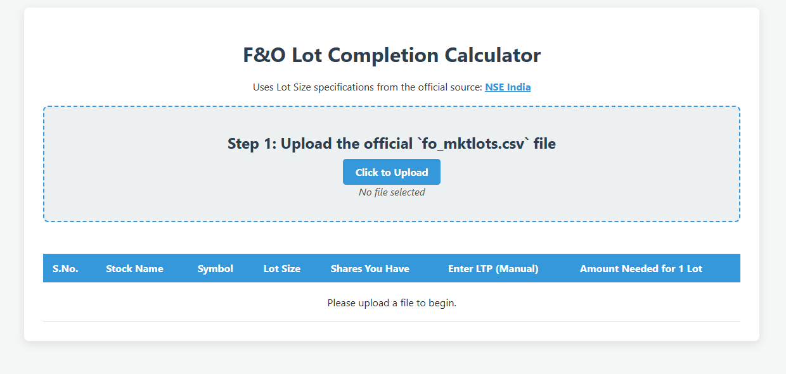

# F&O Lot Completion Calculator

A simple yet powerful web-based tool designed for Indian F&O traders to quickly calculate the investment required to complete a full lot of a stock. This tool uses the official NSE `fo_mktlots.csv` file for accurate lot size data and helps you manage your positions more effectively.

**Live Demo:** **[https://devworlddivey.github.io/fnolotsizecalculator/](https://devworlddivey.github.io/fnolotsizecalculator/)**
*(Note: Your site may take a few minutes to become active after the initial setup.)*

*(To add a screenshot: take a picture of your running application, name it `screenshot.png`, and place it in the same project folder. It will automatically appear here.)*

## Features

*   **Official Lot Size Integration:** Directly uses the daily `fo_mktlots.csv` file from the NSE for 100% accurate lot size information.
*   **Lot Completion Calculation:** The core feature—enter the shares you currently own and the live price to see the exact amount needed to complete one full lot.
*   **Dynamic Symbol Filtering:** Instantly search and filter the entire list by stock symbol to find what you're looking for.
*   **Sortable Columns:** Click on the "Lot Size" header to sort the entire table, making it easy to identify contracts by value.
*   **Quick Price Look-up:** A convenient "Look Up" button for each stock that instantly opens the correct Google Finance page in a new tab.
*   **Data Persistence:** Automatically saves the data you enter (`Shares You Have`, `LTP`) in your browser. When you return, your data is reloaded, saving you time.
*   **Clean & Responsive UI:** A simple and intuitive interface that works well on both desktop and mobile browsers.

## How to Use

1.  **Download the Latest Lot Size File:** Get the official `fo_mktlots.csv` file from the [NSE India Website](https://www.nseindia.com/products-services/equity-derivatives-contract-information).
2.  **Upload the File:** Click the "Click to Upload" button on the web page and select the `fo_mktlots.csv` file you just downloaded. The table will instantly populate.
3.  **Find Your Stock:** Use the "Filter by Symbol..." box to quickly find the stock you want to analyze.
4.  **Enter Your Data:**
    *   In the **"Shares You Have"** column, type the number of shares you currently own for that stock.
    *   In the **"Enter LTP (Manual)"** column, type the current market price. Use the "Look Up" button to find it quickly.
5.  **View the Result:** The **"Amount Needed for 1 Lot"** column will automatically update to show you the exact investment required. If you already have enough shares, it will display "Full Lot Acquired".

## Technologies Used

*   **HTML5:** For the core structure of the page.
*   **CSS3:** For modern styling and a clean layout.
*   **JavaScript (ES6):** For all the application logic, including file reading, calculations, filtering, sorting, and data persistence. No frameworks were used.